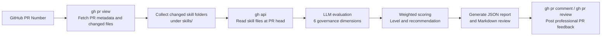

# Skills Quality Evaluator

Use this skill to review skill-related pull requests in GitHub and turn the review into a structured, professional PR comment.

## What This Skill Does

1. Uses `gh` CLI to fetch PR metadata and changed files.
2. Identifies changed skill folders under `skills/`.
3. Reads the skill bundle at the PR head commit.
4. Evaluates each skill against the six governance dimensions.
5. Calculates the weighted total score and recommendation.
6. Writes a JSON report and a polished Markdown review.
7. Optionally posts the result back to the PR as a comment or review.

## Evaluation Flow



## Script Location

`skills/skills-quality-evaluator/scripts/evaluate_skill_pr.py`

## When To Use

Use this skill when the user asks to:

- review a PR that adds or updates one or more skills
- score a skill contribution before merge or publishing
- evaluate skills marketplace submissions
- leave a governance review on a GitHub PR
- inspect `skills/<skill-name>/` changes and summarize strengths, risks, and recommendations

Do not use this skill for:

- general code review outside skill submissions
- repository summarization without a PR
- reviewing application code that does not live under `skills/`

## Inputs

The script expects:

- GitHub repository name, for example `owner/repo`
- PR number
- GitHub CLI authentication already configured
- evaluator model credentials through environment variables

## Environment Variables

Required:

- `EVALUATOR_API_KEY`
- `EVALUATOR_MODEL`

Optional:

- `EVALUATOR_API_BASE_URL` defaults to `https://api.openai.com/v1`
- `EVALUATOR_TEMPERATURE` defaults to `0`

## Usage

Generate report only:

```bash
python3 skills/skills-quality-evaluator/scripts/evaluate_skill_pr.py \
  --repo owner/repo \
  --pr 123
```

Generate report and post a PR comment:

```bash
python3 skills/skills-quality-evaluator/scripts/evaluate_skill_pr.py \
  --repo owner/repo \
  --pr 123 \
  --post-comment
```

Generate report and submit a PR review comment:

```bash
python3 skills/skills-quality-evaluator/scripts/evaluate_skill_pr.py \
  --repo owner/repo \
  --pr 123 \
  --submit-review
```

## Outputs

By default the script writes to:

`test-results/skills-quality-evaluator/<repo>/<pr-number>/<timestamp>/`

It creates:

- `pr_metadata.json`
- one `*_evaluation.json` per skill
- `pr_review_comment.md`
- `run_summary.json`

## Review Rules

- Only evaluate skills changed under `skills/`.
- If a PR does not touch any skill folder, stop and report that clearly.
- Do not fabricate skill content when `gh` cannot fetch a file.
- Keep the final PR comment professional and decision-oriented.
- Use the bundled evaluation framework and prompt, not ad hoc criteria.
- Recompute the weighted total score locally from the six dimension scores.

## References

Read these when using or modifying the skill:

- [skill_evaluation_framework.md](/Users/olivia/shawn/codespace/knowledgebase/skills/skills-quality-evaluator/references/skill_evaluation_framework.md)
- [skill_review_prompt.md](/Users/olivia/shawn/codespace/knowledgebase/skills/skills-quality-evaluator/references/skill_review_prompt.md)
