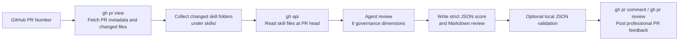

# Skills Quality Evaluator

Use this skill to review skill-related pull requests in GitHub and turn the review into a structured JSON assessment plus a professional PR comment.

## What This Skill Does

1. Uses `gh` CLI to fetch PR metadata and changed files.
2. Identifies changed skill folders under `skills/`.
3. Materializes the changed skill bundle from the PR head commit into a local review workspace.
4. The agent evaluates each skill against the six governance dimensions.
5. The agent writes strict JSON review output and a polished Markdown review comment.
6. Optionally validates the JSON schema locally.
7. Optionally posts the result back to the PR as a comment or review.

## Evaluation Flow



## Script Location

`skills/skills-quality-evaluator/scripts/evaluate_skill_pr.py`

## When To Use

Use this skill when the user asks to:

- review a PR that adds or updates one or more skills
- score a skill contribution before merge or publishing
- evaluate skills marketplace submissions
- leave a governance review on a GitHub PR
- inspect `skills/<skill-name>/` changes and summarize strengths, risks, and recommendations

Do not use this skill for:

- general code review outside skill submissions
- repository summarization without a PR
- reviewing application code that does not live under `skills/`

## Inputs

The workflow expects:

- GitHub repository name, for example `owner/repo`
- PR number
- GitHub CLI authentication already configured
- the agent to perform the actual qualitative review

## Core Rule

Do not call a separate evaluator model API for this skill.
The agent is the judge.
Use `gh` CLI to fetch the PR and skill files, then perform the evaluation directly in the agent using the framework in the references folder.

## Usage

Collect PR context for agent review:

```bash
python3 skills/skills-quality-evaluator/scripts/evaluate_skill_pr.py \
  --repo owner/repo \
  --pr 123
```

Validate an agent-generated JSON review:

```bash
python3 skills/skills-quality-evaluator/scripts/evaluate_skill_pr.py \
  --repo owner/repo \
  --pr 123 \
  --validate-review-json /path/to/review.json
```

Post a prepared Markdown PR comment:

```bash
python3 skills/skills-quality-evaluator/scripts/evaluate_skill_pr.py \
  --repo owner/repo \
  --pr 123 \
  --post-comment-file /path/to/pr_review_comment.md
```

## Outputs

By default the script writes to:

`test-results/skills-quality-evaluator/<repo>/<pr-number>/<timestamp>/`

It creates:

- `pr_metadata.json`
- `changed_skill_dirs.json`
- a materialized copy of each changed skill bundle under `skill_bundles/`
- one `*_review_stub.json` per skill under `review_stubs/`
- `pr_review_comment_template.md`
- `run_summary.json`

The agent should produce one evaluation JSON per skill using this structure:

```json
{
  "overall_score": 91,
  "overall_comment": "This skill is well-designed, deterministic, and aligned with best practices. It demonstrates strong structure and high reusability, with only minor improvements needed in edge-case handling.",
  "recommendation": "Human Review",
  "details": {
    "trigger_discoverability": {
      "score": 92,
      "comment": "Clear triggering conditions with both positive and negative cases defined. Minor ambiguity in edge scenarios."
    },
    "instruction_quality": {
      "score": 90,
      "comment": "Well-structured and mostly deterministic instructions. Could further improve by adding explicit decision branches."
    },
    "determinism_reliability": {
      "score": 88,
      "comment": "Outputs are generally stable, but some steps rely on LLM interpretation rather than deterministic logic."
    },
    "structure_best_practice": {
      "score": 95,
      "comment": "Fully aligned with skill best practices, including proper structure and progressive disclosure."
    },
    "safety_compliance": {
      "score": 94,
      "comment": "Clearly defines safe usage boundaries and avoids risky operations."
    },
    "business_value_reusability": {
      "score": 93,
      "comment": "High business value and reusable across multiple teams and scenarios."
    }
  }
}
```

## Review Rules

- Only evaluate skills changed under `skills/`.
- If a PR does not touch any skill folder, stop and report that clearly.
- Do not fabricate skill content when `gh` cannot fetch a file.
- Keep the final PR comment professional and decision-oriented.
- Use the bundled evaluation framework and prompt, not ad hoc criteria.
- Use the exact JSON schema shown above.
- Accept only `Approve`, `Human Review`, or `Reject` as recommendation values.
- Use the helper script for GitHub data collection, JSON validation, and PR posting, not for model-based judging.

## References

Read these when using or modifying the skill:

- [skill_evaluation_framework.md](/Users/olivia/shawn/codespace/shawn-skills/skills/skills-quality-evaluator/references/skill_evaluation_framework.md)
- [skill_review_prompt.md](/Users/olivia/shawn/codespace/shawn-skills/skills/skills-quality-evaluator/references/skill_review_prompt.md)
